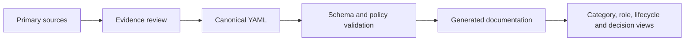

<!-- Generated by scripts/generate_docs.py; do not edit directly. -->
# DevOps Tools Catalog

[](https://github.com/goozcena-gnl/devops-tools-catalog/actions/workflows/quality.yml) [](https://github.com/goozcena-gnl/devops-tools-catalog/releases/latest) [](LICENSE)

**Evidence-backed catalog of DevOps, Cloud, Platform Engineering, SRE and DevSecOps tools.**

This repository is a machine-validated tooling knowledge base, not just a list of bookmarks. It combines structured records with licence, lifecycle, provenance, and review metadata, then generates practical category, role, lifecycle, and decision views.

> The YAML under `data/` is authoritative. Generated Markdown is navigation, not a second source of truth. Unverified metadata remains visibly marked for review.

## Why this catalog exists

The DevOps ecosystem changes faster than a static list can safely represent: projects are renamed or archived, licences change, commercial and community editions diverge, and similar products are easily duplicated. This catalog treats those changes as a data-governance problem. Claims are tied to evidence, uncertainty is retained, and generated views are reproducible from canonical data.

## Catalog at a glance

| Measure | Current value |
|---|---:|
| Canonical tool and resource records | **1,423** |
| Categories | **30** |
| Engineering roles | **13** |
| Lifecycle stages | **12** |
| Records not flagged for review | **601** |
| Records requiring review | **822** |
| Deprecated, archived, or historical records | **14** |
| Archived source repositories | **11** |
| Most recent recorded verification date | **2026-09-16** |

Review debt is deliberate and actionable; it is not hidden to improve the numbers. A record marked `needs-review` is useful discovery context, not a verified recommendation.

## Find tools by task

| I need to... | Start here |
|---|---|
| Build a Kubernetes platform | [Kubernetes operations](docs/categories/kubernetes-distributions-operations.md) |
| Choose an IaC stack | [IaC decision guide](docs/decision-guides/terraform-opentofu-pulumi.md) |
| Build a secure CI/CD pipeline | [Supply-chain security](docs/categories/software-supply-chain-security.md) |
| Observe Kubernetes | [Monitoring and tracing](docs/categories/monitoring-metrics-logs-tracing.md) |
| Assemble an OSS-first stack | [Default stacks](docs/default-stacks.md#oss-first-environment) |
| Work with Azure, AWS, or GCP | [Cloud platforms](docs/categories/cloud-platforms-management.md) |
| Build a homelab | [Virtualization and homelab](docs/categories/virtualization-bare-metal-homelab.md) |
| Build an MLOps platform | [MLOps and AI infrastructure](docs/categories/mlops-llmops-ai-infrastructure.md) |
| Add FinOps controls | [FinOps and sustainability](docs/categories/finops-sustainability.md) |

## How the catalog is built



- `data/tools/*.yaml` stores the canonical records; `data/taxonomy.yaml` defines the allowed vocabulary.
- `schema/`, `scripts/`, and `tests/` enforce structure, identity, provenance, links, generation, and repository hygiene.
- `migration/` preserves legacy-source reconciliation instead of erasing import history.
- GitHub Actions runs the fast quality gate on every pull request; the full network link audit runs separately on a schedule.

See the [methodology](docs/methodology.md), [review-debt workflow](docs/methodology.md#evidence-order), [default stacks](docs/default-stacks.md), and [decision guides](docs/decision-guides/README.md).

## Representative record

Every entry carries operational context as well as discovery metadata. This abbreviated example is rendered from the canonical `crun` record:

```yaml
id: crun
name: crun
summary: OCI container runtime implemented in C for running Linux containers.
categories: [containers-image-tooling]
roles: [platform-engineer]
lifecycle_stages: [deploy, operate]
license_model: oss
license_spdx: GPL-2.0-or-later
status: active
verified_on: 2026-09-09
needs_review: false
# 4 evidence sources are retained in the canonical record
```

`license_model` describes the distribution or offering boundary; `license_spdx` is set only when supported by evidence. `status`, `verified_on`, and `needs_review` make lifecycle and verification debt explicit. `use_when` and `avoid_when` fields turn a listing into decision support.

## Browse the catalog

### By category

| Category | Records |
|---|---:|
| [Foundations, Linux and scripting](docs/categories/foundations-linux-scripting.md) | 56 |
| [Source control and repository management](docs/categories/source-control-repository-management.md) | 16 |
| [Cloud platforms and cloud management](docs/categories/cloud-platforms-management.md) | 26 |
| [Infrastructure as Code](docs/categories/infrastructure-as-code.md) | 37 |
| [Configuration management](docs/categories/configuration-management.md) | 18 |
| [Virtualization, bare metal and homelab](docs/categories/virtualization-bare-metal-homelab.md) | 71 |
| [Containers and image tooling](docs/categories/containers-image-tooling.md) | 24 |
| [Kubernetes distributions and operations](docs/categories/kubernetes-distributions-operations.md) | 151 |
| [Kubernetes networking, storage and add-ons](docs/categories/kubernetes-networking-storage-addons.md) | 136 |
| [CI, build and testing](docs/categories/ci-build-testing.md) | 88 |
| [CD, GitOps, release and promotion](docs/categories/cd-gitops-release-promotion.md) | 34 |
| [Artifact and package management](docs/categories/artifact-package-management.md) | 21 |
| [Platform engineering and internal developer platforms](docs/categories/platform-engineering-idp.md) | 12 |
| [Developer experience and local environments](docs/categories/developer-experience-local-environments.md) | 108 |
| [Monitoring, metrics, logs and tracing](docs/categories/monitoring-metrics-logs-tracing.md) | 102 |
| [SRE, incident response and on-call](docs/categories/sre-incident-response-on-call.md) | 23 |
| [Backup, disaster recovery and resilience](docs/categories/backup-disaster-recovery-resilience.md) | 15 |
| [Chaos and performance engineering](docs/categories/chaos-performance-engineering.md) | 25 |
| [Application and cloud security](docs/categories/application-cloud-security.md) | 186 |
| [IAM, secrets and certificate management](docs/categories/iam-secrets-certificates.md) | 44 |
| [Software supply-chain security](docs/categories/software-supply-chain-security.md) | 17 |
| [Policy, governance and compliance](docs/categories/policy-governance-compliance.md) | 4 |
| [FinOps and sustainability](docs/categories/finops-sustainability.md) | 31 |
| [Databases, caching and data infrastructure](docs/categories/databases-caching-data-infrastructure.md) | 30 |
| [Serverless, edge and WebAssembly](docs/categories/serverless-edge-webassembly.md) | 10 |
| [Workflow automation and ChatOps](docs/categories/workflow-automation-chatops.md) | 18 |
| [MLOps, LLMOps and AI infrastructure](docs/categories/mlops-llmops-ai-infrastructure.md) | 83 |
| [Documentation, learning and career resources](docs/categories/documentation-learning-career.md) | 64 |
| [Emerging and experimental tools](docs/categories/emerging-experimental.md) | 58 |
| [Deprecated and historical tools](docs/categories/deprecated-historical.md) | 8 |

### By role

[DevOps Engineer](docs/roles/devops-engineer.md) · [Cloud Engineer](docs/roles/cloud-engineer.md) · [Platform Engineer](docs/roles/platform-engineer.md) · [Site Reliability Engineer](docs/roles/site-reliability-engineer.md) · [DevSecOps Engineer](docs/roles/devsecops-engineer.md) · [Infrastructure and Systems Engineer](docs/roles/infrastructure-systems-engineer.md) · [Kubernetes Engineer](docs/roles/kubernetes-engineer.md) · [FinOps Engineer](docs/roles/finops-engineer.md) · [MLOps and AI Infrastructure Engineer](docs/roles/mlops-ai-infrastructure-engineer.md) · [Developer Experience Engineer](docs/roles/developer-experience-engineer.md) · [Release Engineer](docs/roles/release-engineer.md) · [Observability Engineer](docs/roles/observability-engineer.md) · [Cloud Security Engineer](docs/roles/cloud-security-engineer.md)

### By lifecycle

[Plan](docs/lifecycle/plan.md) · [Develop](docs/lifecycle/develop.md) · [Build](docs/lifecycle/build.md) · [Test](docs/lifecycle/test.md) · [Release](docs/lifecycle/release.md) · [Deploy](docs/lifecycle/deploy.md) · [Operate](docs/lifecycle/operate.md) · [Monitor](docs/lifecycle/monitor.md) · [Secure](docs/lifecycle/secure.md) · [Optimize](docs/lifecycle/optimize.md) · [Learn](docs/lifecycle/learn.md) · [Retire](docs/lifecycle/retire.md)

## Licence-model legend

| Model | Meaning | Records |
|---|---|---:|
| `oss` | Source claims an OSI-approved licence; verify SPDX before adoption. | 925 |
| `source-available` | Source is visible under a non-OSI or restricted licence. | 23 |
| `open-core` | OSS/community core with commercial features or service. | 110 |
| `commercial` | Proprietary commercial product. | 139 |
| `free-saas` | Hosted service with a free offering. | 5 |
| `documentation` | Learning or documentation resource. | 108 |
| `unknown` | Reliable licence evidence has not been recorded. | 113 |

## Project-status legend

| Status | Meaning | Records |
|---|---|---:|
| `active` | Maintained according to recorded primary-source evidence. | 588 |
| `needs-review` | Imported but not yet fully verified. | 821 |
| `deprecated` | Superseded or discouraged by its maintainer. | 2 |
| `archived` | Repository or product is archived. | 10 |
| `historical` | Retained for context or migration work. | 2 |

## Methodology and trust model

The [catalog methodology](docs/methodology.md) defines inclusion, evidence priority, identity and duplicate rules, licence classification, lifecycle handling, and migration provenance. [Deprecated and historical records](docs/deprecated-tools.md) remain visible for migration context but are excluded from default recommendations.

Metadata is evidence-backed, not guaranteed forever. Consumers should re-check cited primary sources before making security, legal, procurement, or production decisions.

## Contributing

Edit canonical YAML, provide primary-source evidence, regenerate documentation, and open a focused pull request. Do not manually edit generated pages or resolve review flags without evidence. Start with [CONTRIBUTING.md](CONTRIBUTING.md) or use a [structured issue template](https://github.com/goozcena-gnl/devops-tools-catalog/issues/new/choose).

Security concerns belong in [SECURITY.md](SECURITY.md), not a public issue.

## Validation

```bash
python -m ruff check scripts tests
python -m ruff format --check scripts tests
python -m pytest
python -m scripts.generate_docs --check
python -m scripts.validate_catalog
```

The network-dependent strict link audit is intentionally separate: `python -m scripts.check_links --strict --check-archived --workers 8`.

## Licence and attribution

Repository-owned code, documentation, and original catalog metadata are available under the [MIT License](LICENSE). Listed tools, product names, trademarks, linked content, and third-party projects remain the property of their respective owners and retain their own licences. See [licensing and attribution](docs/licensing.md).
